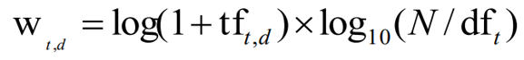
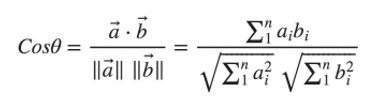
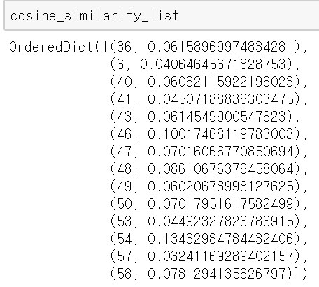

# TF- IDF(Term Frequency - Inverted Document Frequency)란?

TF-IDF란 1세대 정보검색 기술로 page rank가 등장하기 전 사용되었던 기술이다. 아주 간단한 정보검색을 하는 방식은 각 document에 어떤 word가 있는 지 큰 테이블에 저장하는 방식이였다. 하지만, 이런 경우 table에서 모든 document를 하나씩 검색해서 찾아야 했고, 또 각 테이블마다 모든 단어의 존재 유무 및 개수를 저장해놓고 있어야 했다. 

## Inverted Table
이렇게 되면, 단어의 수가 몇 만, 십만, 백만 개가 되고 document또한 비슷한 개수가 되면, 이 정보를 모두 가지고 있는 table을 만든다는 건 상상이 되지 않는다. 이럴 때 등장한 것이 INVERTED TABLE이다.

Inverted Table은 기준이 문서가 아니라 단어이다. 그래서, 각 단어를 기준으로 그 단어가 속한 document의 index를 linked list로 구현한 것이 inverted Table이다. 

## TF-IDF
하지만, inverted table은 그 단어가 속한 document만 보여줄 뿐, 그 단어와 document가 얼마나 연관성이 있는 지 보여주진 못한다. 그래서, 이 연관성을 보여주기 위해서 나온 것이 tf-idf이다.

위에서 소문자 t는 우리가 구하고 싶은 term, 소문자 d는 document이다. 대문자 N은 모든 문자의 개수이다. 

### TF (Term Frequency)
TF Vector는 word count vector이다. 즉, 특정한 term 단어가 document에 얼마나 자주 나오는 지를 보여주는 지표이다. 즉, 이 값이 높을 수록 이 단어는 문서에서 중요하다고 볼 수 있다. 

### DF (Document Frequency)
Doucment Frequency, 문서 빈도는 이 term이 얼마나 다른 document에 나왔는 지를 보여주는 지표이다. 이 값의 역수가 idf (inverse document frequency)이다. 

즉, 특정한 term이 특정한 document에 많이 나올수록 (TF가 높을 수록), 반대로 term이 나온 문서의 개수가 적을수록 (N의로 나뉘어지기 때문에 df값이 클수록 값이 작아진다) 그 term과 document사이의 tf-idf값이 커지게 된다!

### Cosine Similarity
그러면 이제 query와 document간의 각도를 활용한 cosine similarity를 사용하여 얼마나 연관이 있는 지를 볼수가 있다. document와 query의 tf-idf값과 query만의 tf-idf값을 구한 후, cosine similarity를 계산할 수 있다. 그런 다음, cosine similarity의 값을 기준으로 가장 높을 5개의 document를 구하다.

1. Documents를 index한다. 

2. 각 document를 token화 하고 stopwords를 제거하고 stemming해준다. 

3. 각 document에서 각 token별로 token이 몇개 있는지를 table로 저장한다.

4. 각 token별 어떤 document가 있는 지 inverted index를 구한다

5. inverted index를 통해 query를 포함하는 document를 구한다. 

6. query와 document 사이의 tf-idf를 구한다. 

7. query의 tf-idf를 구한다. 

8. 각 query와 document간의 cosine similarity를 구한다. 

9. cosine similarity를 기준으로 상위 5개의 document를 구한다. 

결과

